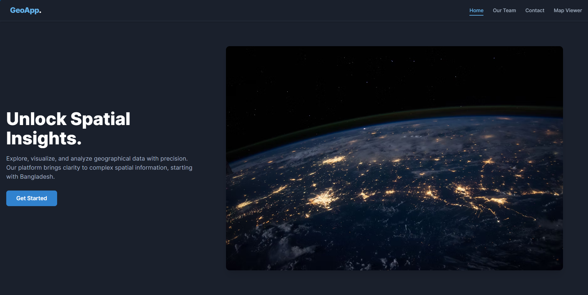
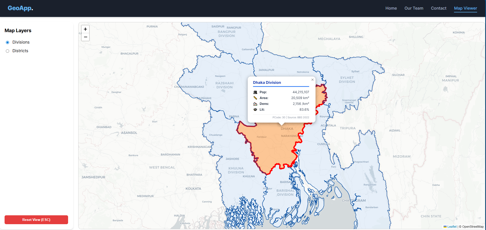
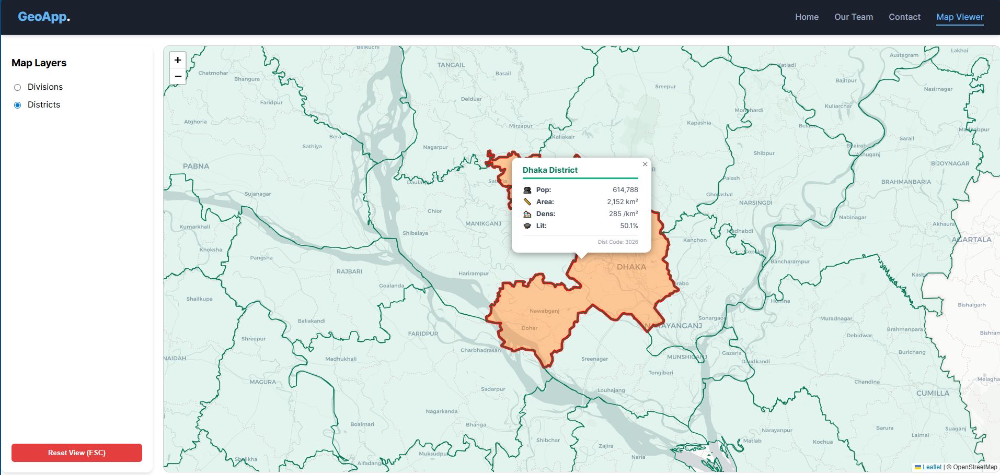

# Bangladesh Interactive GIS Portal

A professional Full-Stack Spatial Data Application designed to visualize and analyze Bangladesh's administrative hierarchy. Built with **React (Leaflet)** for the interactive frontend and **.NET 10 Web API** for a robust, data-driven backend.

---

## 📸 Application Preview

### 1. Modern UI & Experience
The application features a responsive, dark-themed hero section and a clean grid layout for team presentation.

| **Landing Page** | **Team Section** |
|:---:|:---:|
|  |  |
| *Stunning hero section with navigation* | *Responsive grid showing expert profiles* |

### 2. Advanced GIS Visualization
Users can toggle between administrative layers. The app dynamically fetches census data (Population, Area, Literacy) from the backend based on the selected region.

| **Division Layer (Level 1)** | **District Layer (Level 2)** |
|:---:|:---:|
|  |  |
| **Theme:** Blue | **Theme:** Green |
| *Shows 8 major divisions with aggregated data* | *Drill-down to 64 districts with distinct styling* |

---

## 🚀 Key Features

* **Dual-Layer Architecture:** Seamless switching between **Division** and **District** layers using the sidebar controls.
* **Dynamic Data Linking:** Uses **P-Codes** (unique geographic identifiers) to link GeoJSON shapes with live SQLite database records.
* **Interactive Popups:** Clicking a region triggers a real-time fetch to display rich HTML popups with icons and census statistics.
* **Smart Navigation:**
    * **Auto-Zoom:** Smooth "Fly-to" animation centers the camera on the selected region.
    * **Highlighting:** Active regions glow with a custom color and thick red border.
    * **Keyboard Control:** Press `ESC` or the Reset button to return to the national view.

---

## 🛠️ Tech Stack

### Frontend (Client)
* **Framework:** React 18 (Vite)
* **Mapping Engine:** Leaflet.js & React-Leaflet
* **State Management:** React Hooks (`useState`, `useEffect`, `useRef`)
* **Styling:** CSS-in-JS & Flexbox Layouts

### Backend (Server)
* **Framework:** ASP.NET Core 8.0 Web API
* **Database:** SQLite (embedded relational database)
* **ORM:** Entity Framework Core
* **Architecture:** RESTful API with Controller-Service pattern

---

## ⚙️ Installation Guide

### 1. Backend Setup (.NET)
Navigate to the `GisBackend` folder.

```bash
cd GisBackend

# Restore packages
dotnet restore

# Setup Database (creates gis.db)
dotnet ef database update

# (Optional) Seed dummy district data
# Ensure 'bd_districts.geojson' is in the folder
python generate_sql.py

# Run the API
dotnet run
```
### 2. Frontend Setup (React)
Navigate to the gis-frontend folder.
```bash
cd gis-frontend

# Install dependencies
npm install

# Configure API Endpoint
# Create a .env file and add your backend URL
echo "VITE_API_URL=http://localhost:5224" > .env

# Start the App
npm run dev
```
Client runs on: http://localhost:5173

### 📂 Data Sources & Credits
Administrative Boundaries: GADM (Global Administrative Areas).

Census Data: Bangladesh Bureau of Statistics (BBS) Population & Housing Census 2022.

Icons: Standard Unicode Emoji set.

### 📄 License
This project is open-source and available under the MIT License.